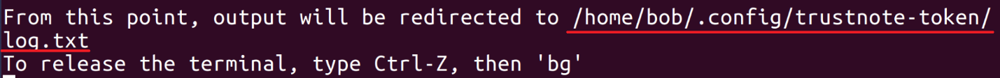

How to Create Your TRC-20 Token on Ubuntu 16.04
===============================

### Introduction
TrustNote is a Directed Acyclic Graph (DAG) based distributed ledger and its development platform for the tokenized economy. One of its use cases is to allow developers to create, issue, and manage tokens or digital assets in a fast and easy way. 
With the recent release of TrustNote’s TRC-20 token specification, we also released a sample code in JavaScript. It shows you how to create a TRC-20 compatible token, transfer assets, and check the balance on TrustNote’s testnet. 
In this guide, I’ll walk you through the use of the sample code and some of our tools, so you can create your own token, transfer assets, and check your balance, by modifying a few lines of the code.

<!-- //NODE.JS ENV  -->
<!-- // VERSION  -->

### Requirements

Ubuntu 16.0.4
This guide assumes that you are using Ubuntu 16.04. Before you begin, you should have a non-root user account with `sudo` privileges set up on your system. 
Node.js 8
You can run` node -v `to check if you have installed Node.js 8 correctly. If not, you can check nodejs.org for how to install Node.js 8 on Ubuntu based Linux distributions.


### How to Install the Sample Code and Sync Your Node

#### Clone from the source:
git clone https://github.com/trustnote/trustnote-token.git
#### Install the code using npm:

```bash
cd trustnote-token
npm install
```
It will take some time to install depending on your network connection, please be patient. Once finished, we need to change the address of the genesis unit from mainnet to testnet:

- Find constants.js from trustnote-token/node_modules/trustnote-common directory.

- Open the file using your editor of choice and find the section named GENESIS_UNIT (should be at line: 13), replace the value from `rg1RzwKwnfRHjBojGol3gZaC5w7kR++rOR6O61JRsrQ=` to `MtzrZeOHHjqVZheuLylf0DX7zhp10nBsQX5e/+cA3PQ= ` and save the file.

### Start the service on your node and wait for data synchronization:
```bash
node start.js
```
Press Enter to accept the default action when you are prompt for input. 
You can proceed to the steps when you see the following message:

**Note：** The message above shows the log file's path, you can view the live status of data synchronization by tail -f <logfilepath>.  Data synchronization may take about 15 minutes or longer to complete depending on your network speed. When start.js is executed in the first time, your Passphrase will be written in the same directory as the log file, its matching wallet address will be generated and saved in a file called address.json in your trustnote-token directory.


### How to Get TTT Test Notes

Issue tokens on TrustNote’s mainnet will cost you TTT Notes. You can buy TTT Notes from cryptocurrency market such as Bit-Z. But for testing purposes, you can get some TTT Test Notes for free:
-	Find and open address.json from trustnote-token directory, copy the address
- Open www.trustnote.org/token.html from your web browser, paste the address in the "Send to Address" input form and press the button below, then you will receive some TTT Test Notes in that address
- You can check your balance by open the testnet explorer, enter your address in the search field and press the search button.
Note: TTT Test Notes can be used to issue tokens and pay for the transactions on the testnet, however it doesn’t work on TrustNote’s mainnet.

### How to Issue Your Tokens


By default, the amount of the tokens to be issued is `1,000,000,000,000`. If you want to issue another number of tokens, you can:
- Find` create_asset.js` from trustnote-token directory 
- Open the file using your editor of choice, change `cap: 1,000,000,000,000` in line 14 to the amount you like and save the file.

Now you can issue your own token by run the following command:
```bash
node create_asset.js 
```
Press `Enter` to accept the default action when you are prompt for input.

If successful, a file called `asset.json` will be generated in your trustnote-token directory, then you can check your tokens by:
- Find and open asset.json from trustnote-token directory, `copy` the value of your `TokenId`, note TokenID is the identifier of the token just been issued
- Open the  [testnet explorer](https://testexplorer.trustnote.org/), enter your `TokenId` in the search field and press the search button.

### How to Transfer Your Tokens

- Find `transfer_asset.js` from trustnote-token directory 
- Open the file using your editor of choice, replace `DJw4edxgaSbt7VGTsmsadmRdYJ+Vvz1Hrhy+JGrAyiA=` in line: 11 with your `TokenID` from asset.json, and save the file
- You can also change the transfer amount from 15 in line :11 to any amount that you want to try. In my case, I just change it to 80, and save the file


Now you can transfer the token by run the following command:
```bash
node transfer_asset.js 
```
Press `Enter` to accept the default action when you are prompt for input.

If successful, 80 tokens will be transferred to `LDFEZ5TWE4XW4NUAUQHCMEPEQV7NAX6X`, the default destination address which is hardcoded in `transfer_asset.js` at line: 11, you can check the results of the transfer by: 
- Open the [testnet explorer](https://testexplorer.trustnote.org/) ,enter the destination address in the search field and press the search button.


### Now What ?

Congratulations if you have made this far! Now that you have your own tokens, I hope you enjoy the benefit of easy to develop, high speed transaction performance and low transaction cost delivered by TrustNote!

Please keep in mind that real production grade token issuance and management will take more efforts and thorough tests. 

Thanks for reading this. If you have any questions, please feel free to comment below.


**Note：** 
 testnet explorer can be accessed from https://testexplorer.trustnote.org
