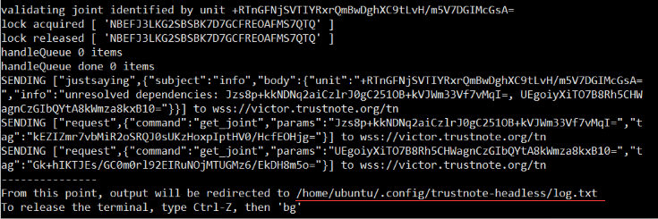

How to issue token on TrustNote testnet
===============================

The following procedure has been tested on ubuntu version 16.04 successfully.


<!-- //NODE.JS ENV  -->
<!-- // VERSION  -->

### Install required tools on Ubuntu

```bash
curl -sL https://deb.nodesource.com/setup_8.x | sudo -E bash -
sudo apt-get install -y nodejs
```

### Download trustnote source code

```bash
git clone https://github.com/trustnote/trustnote-token.git
```
### Run npm install 
```bash
cd trustnote-token
npm install
```
this will takes sometime.

### Setting testnet environment
```bash
bash testify.sh
```

### Starting a Node

Synchronizing data
``` bash
node start.js
```
set device name,press `Enter`


set passphrase，press `Enter`


the log file path can be found in terminal 


this will take about 15~20 minutes.


###  Getting some TTT Notes for your testing

Each transaction will cost some TTT notes, developers can get some notes by:

1：go to www.trustnote.org/token.html 

2：enter you address(address can be found in `address.json` file)


3：Get your Notes.


###    Issue token
``` bash
node create_asset.js
```
token id can be found in asset.json


###    Transfer token
 1. set parameter 

 replace `DJw4edxgaSbt7VGTsmsadmRdYJ+Vvz1Hrhy+JGrAyiA=` with your own token id in file `transfer_asset.js`

 2. run script
``` bash
node transfer_asset.js
```
###    Get balance
go to testnet explorer, entering your address in the search field and search.


**Note：** 
 testnet explorer can be accessed from https://testexplorer.trustnote.org
